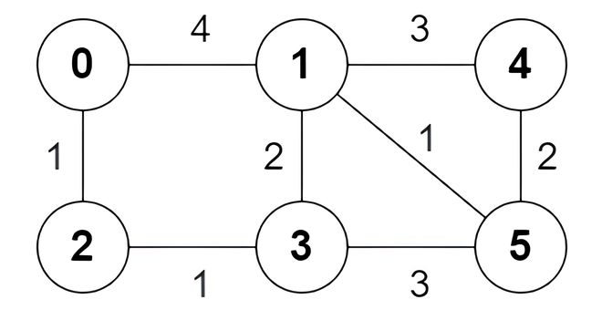
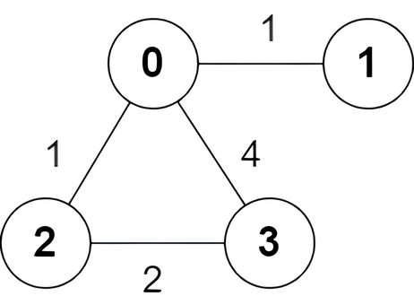
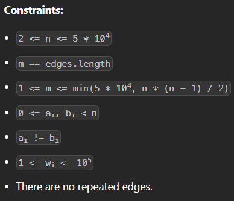
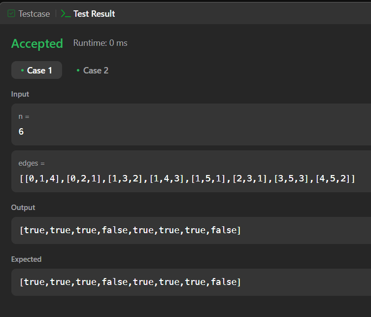
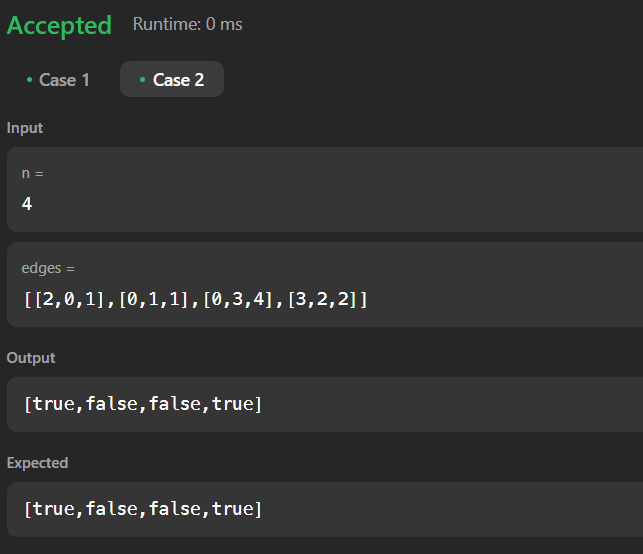

# 3123. Find Edges in Shortest Paths
 [Link para Questão](https://leetcode.com/problems/find-edges-in-shortest-paths/)

#### Nível de dificuldade: Hard

You are given an undirected weighted graph of n nodes numbered from 0 to n - 1. The graph consists of m edges represented by a 2D array edges, where edges[i] = [ai, bi, wi] indicates that there is an edge between nodes ai and bi with weight wi.

Consider all the shortest paths from node 0 to node n - 1 in the graph. You need to find a boolean array answer where answer[i] is true if the edge edges[i] is part of at least one shortest path. Otherwise, answer[i] is false.

Return the array answer.

Note that the graph may not be connected.

 

#### Example 1:

Input: n = 6, edges = [[0,1,4],[0,2,1],[1,3,2],[1,4,3],[1,5,1],[2,3,1],[3,5,3],[4,5,2]]

Output: [true,true,true,false,true,true,true,false]

#### Explanation:

The following are all the shortest paths between nodes 0 and 5:

The path 0 -> 1 -> 5: The sum of weights is 4 + 1 = 5.
The path 0 -> 2 -> 3 -> 5: The sum of weights is 1 + 1 + 3 = 5.
The path 0 -> 2 -> 3 -> 1 -> 5: The sum of weights is 1 + 1 + 2 + 1 = 5.

#### Example 2:

Input: n = 4, edges = [[2,0,1],[0,1,1],[0,3,4],[3,2,2]]

Output: [true,false,false,true]

#### Explanation:

There is one shortest path between nodes 0 and 3, which is the path 0 -> 2 -> 3 with the sum of weights 1 + 2 = 3.

#### Constraints:

#### Submissions:

