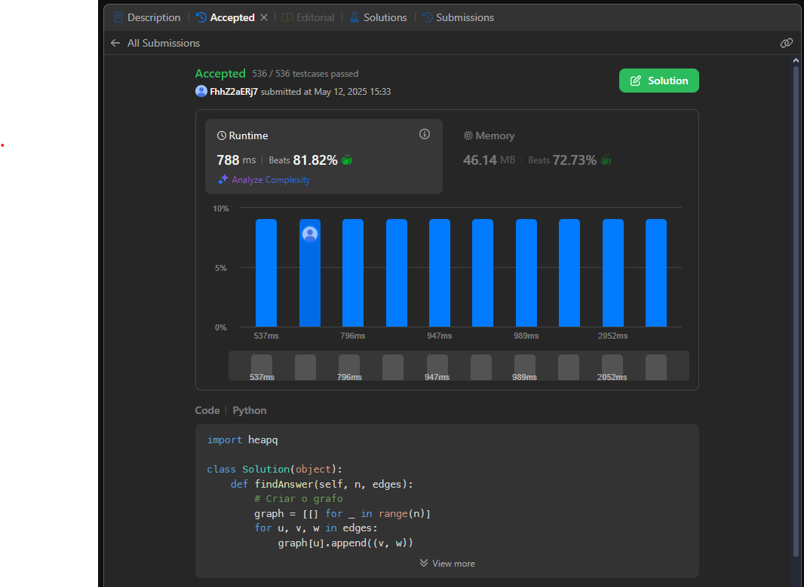
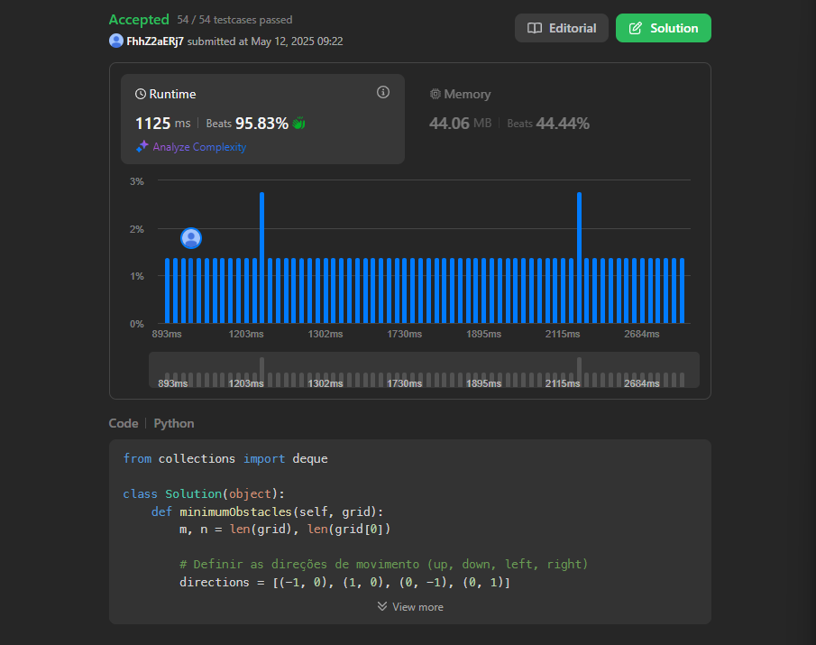
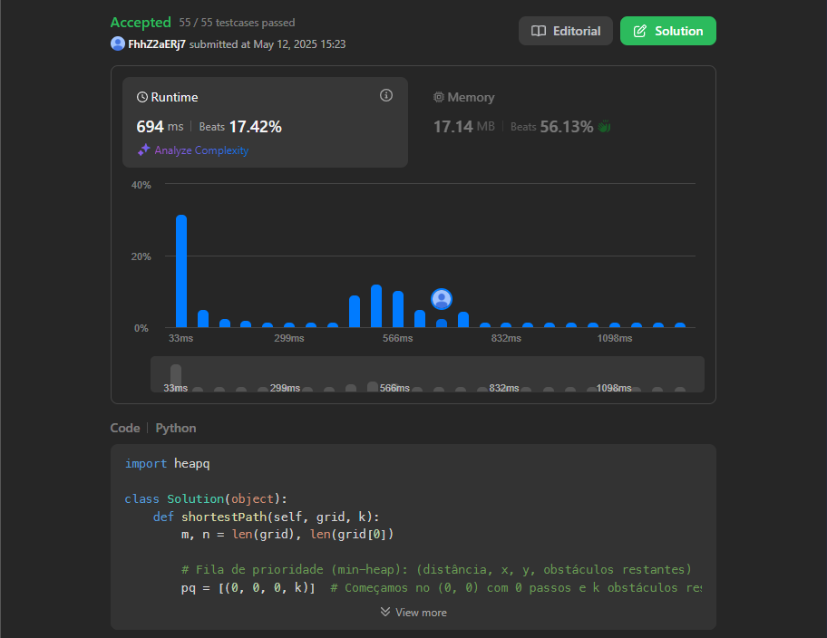

# 📘 Lista 2 - Grafos 2

**Número da Lista**: 2<br>
**Conteúdo da Disciplina**: Grafos 2<br>

## 👨‍💻 Alunos
| Matrícula | Aluno |
| --------- | ------------------------------- |
| 20/0060783 | Ana Beatriz W. Massuh |
| 21/1063194 | Lucas Victor Ferreira de Araújo |

## 📌 Sobre

Este repositório contém as soluções desenvolvidas para a **Lista 2** da disciplina de **Grafos 2**. As atividades exploram conceitos fundamentais e avançados em grafos, com a aplicação de algoritmos clássicos para resolução de problemas computacionais.

### 🧠 Conteúdo Abordado

- Representação de grafos direcionados e não direcionados
- Algoritmos de busca: BFS (Busca em Largura) e DFS (Busca em Profundidade)
- Ordenação topológica
- Componentes fortemente conexos
- Algoritmos de caminhos mínimos e árvores geradoras mínimas:
  - Dijkstra
  - Kruskal
  - Prim

## 🖼️ Screenshots

### Questão 1


### Questão 2



### Questão 3


### Questão 4



### Questão 5



## ⚙️ Instalação

**Linguagem**: Python 
**Biblioteca**:

## 💡 Como executar

1. Clone este repositório:
   ```bash
   git clone https://github.com/projeto-de-algoritmos-2025/Grafos2_ResolucaoExercicios.git
   ```

2. Navegue até o diretório do projeto:
    ``` bash
    cd Grafos_2
    ```

3. Execute os scripts em Python com:
   ```bash
   python3 nome_do_arquivo.py
   ```

## Questões:

<div align="center">

| Questão           | Solução                 | Dificuldade             |
| ------------------| ----------------------- | ----------------------- |
| [Questão 1](https://github.com/projeto-de-algoritmos-2025/Grafos2_ResolucaoExercicios/blob/main/Quest%C3%B5es/Quest%C3%A3o_1.md)| [Solução 1](https://github.com/projeto-de-algoritmos-2025/Grafos2_ResolucaoExercicios/blob/main/Solu%C3%A7%C3%B5es/Solu%C3%A7%C3%A3o_1.py)| Difícil |
| [Questão 2](https://github.com/projeto-de-algoritmos-2025/Grafos2_ResolucaoExercicios/blob/main/Quest%C3%B5es/Quest%C3%A3o_2.md)| [Solução 2](https://github.com/projeto-de-algoritmos-2025/Grafos2_ResolucaoExercicios/blob/main/Solu%C3%A7%C3%B5es/Solu%C3%A7%C3%A3o_2.py)| Difícil |
| [Questão 3](https://github.com/projeto-de-algoritmos-2025/Grafos2_ResolucaoExercicios/blob/main/Quest%C3%B5es/Quest%C3%A3o_3.md) | [Solução 3](https://github.com/projeto-de-algoritmos-2025/Grafos2_ResolucaoExercicios/blob/main/Solu%C3%A7%C3%B5es/Solu%C3%A7%C3%A3o_3.py) | Média |
| [Questão 4](https://github.com/projeto-de-algoritmos-2025/Grafos2_ResolucaoExercicios/blob/main/Quest%C3%B5es/Quest%C3%A3o_4.md) | [Solução 4](https://github.com/projeto-de-algoritmos-2025/Grafos2_ResolucaoExercicios/blob/main/Solu%C3%A7%C3%B5es/Solu%C3%A7%C3%A3o_4.py) | Difícil |
| [Questão 5](https://github.com/projeto-de-algoritmos-2025/Grafos2_ResolucaoExercicios/blob/main/Quest%C3%B5es/Quest%C3%A3o_5.md) | [Solução 5](https://github.com/projeto-de-algoritmos-2025/Grafos2_ResolucaoExercicios/blob/main/Solu%C3%A7%C3%B5es/Solu%C3%A7%C3%A3o_5.py) | Difícil |


</div>

<p align="center">
  <sub>Fonte: <a href="https://github.com/Lucas13032003">Lucas Víctor</a> e <a href="https://github.com/AnaBeatrizMassuh">Ana Beatriz W. Massuh</a>, 2025</sub>
</p>

   


